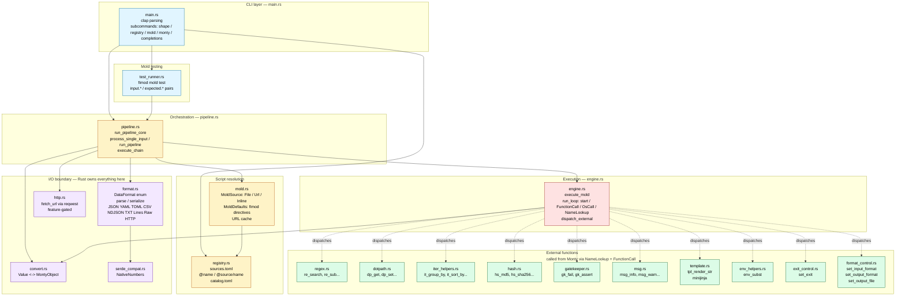

# Fimod — Architecture

How the modules fit together. Companion to `DESIGN_NOTES.md` (decisions & rationale) and `VISION.md` (what we are / aren't).

**Target reader**: a contributor (human or AI) who needs to know where to put a change before writing the first line of code.

## Module map



## Layers

| Layer | Files | Responsibility |
|---|---|---|
| **CLI** | `main.rs` | clap parsing, subcommand dispatch, shell completions, REPL. No business logic. |
| **Orchestration** | `pipeline.rs` | The pipeline contract: read → parse → chain execute → serialize → write. `run_pipeline_core()` is the single source of truth; CLI and library API both delegate. |
| **Script resolution** | `mold.rs`, `registry.rs` | Turn `-m foo.py` / `-m https://…` / `-m @name` into a loaded script + base_dir + mold defaults. Registry manages `sources.toml` and `catalog.toml`. |
| **Engine** | `engine.rs` | `execute_mold()` compiles the script via Monty, then drives `run_loop` — yielding on `FunctionCall` (dispatched to built-ins), `OsCall` (denied for now), `NameLookup` (resolved against the external-function catalog). |
| **Built-ins** | `regex.rs`, `dotpath.rs`, `iter_helpers.rs`, `hash.rs`, `gatekeeper.rs`, `msg.rs`, `template.rs`, `env_helpers.rs`, `exit_control.rs`, `format_control.rs` | Rust-implemented helpers exposed to molds. Each module exports `EXTERNAL_FUNCTIONS: &[&str]` + `dispatch(name, args, …)`. Adding a new helper = extend both and wire it into `engine::is_external_function` + `engine::dispatch_external`. |
| **I/O** | `format.rs`, `http.rs`, `convert.rs`, `serde_compat.rs` | Everything that touches bytes. `DataFormat` is the enum; `Value ↔ MontyObject` conversion is centralised. HTTP is feature-gated behind `reqwest`. |
| **Testing** | `test_runner.rs` | `fimod mold test` discovers `*.input.*` / `*.expected.*` pairs plus optional `*.run-test.toml`, runs the pipeline, diffs the output. |

## End-to-end flow: `fimod s -i data.json -m @clean -o out.yaml`

```mermaid
sequenceDiagram
    participant User
    participant main as main.rs
    participant pipe as pipeline.rs
    participant reg as registry.rs
    participant mold as mold.rs
    participant fmt as format.rs
    participant conv as convert.rs
    participant eng as engine.rs
    participant monty as Monty VM
    participant bi as built-ins

    User->>main: fimod s -i data.json -m @clean -o out.yaml
    main->>pipe: process_single_input(...)
    pipe->>reg: resolve("@clean")
    reg->>mold: MoldSource::File(path)
    mold-->>pipe: script + defaults + base_dir
    pipe->>fmt: detect format (extension → Json)
    pipe->>fmt: parse(content) → serde_json::Value
    pipe->>conv: json_into_monty(value) → MontyObject
    pipe->>eng: execute_mold(script, data, opts)
    eng->>monty: MontyRun::new(script)
    eng->>monty: start(inputs, ...)
    loop run_loop
        monty-->>eng: RunProgress::NameLookup("dp_get")
        eng->>eng: is_external_function → Function
        eng-->>monty: resume(Function)
        monty-->>eng: RunProgress::FunctionCall("dp_get", args)
        eng->>bi: dotpath::dispatch("dp_get", args)
        bi-->>eng: MontyObject
        eng-->>monty: resume(result)
        monty-->>eng: RunProgress::OsCall(...)
        eng-->>monty: resume(None)
        Note over eng: deny-all today; sandbox.toml in 0.5.0
        monty-->>eng: RunProgress::Complete(result)
    end
    eng-->>pipe: (Value, exit_code, format_override, output_file)
    pipe->>fmt: detect out format (-o out.yaml → Yaml)
    pipe->>fmt: serialize(value, Yaml) → String
    pipe->>User: write to out.yaml
```

## Key invariants

- **`serde_json::Value` is the only intermediate representation.** Every `parse()` returns it; every `serialize()` consumes it. Monty operates on `MontyObject`, converted at the engine boundary via `convert.rs`.
- **Monty never sees I/O.** All `RunProgress::OsCall` yields are resumed with `None` (`engine.rs:215-230`). `sandbox.toml` (0.5.0) will make this selective — but the primitive "Monty calls back, Rust decides" stays.
- **External functions are dispatched, not imported.** The mold writes `dp_get(data, "a.b.c")` without any `import`. Monty yields `NameLookup` → engine replies with `Function` → subsequent call yields `FunctionCall` → engine dispatches to `dotpath::dispatch`.
- **Mold chain re-parses on `set_input_format`.** Between chained steps, if a mold called `set_input_format("yaml")`, the current result is re-serialized and re-parsed through the new format (`pipeline.rs:execute_chain`). `"raw"` is only legal as a final-step override.
- **`execute_mold` returns a 4-tuple.** `(Value, Option<i32>, Option<String>, Option<String>)` = result, exit code, output-format override, output-file override. Any new runtime-overridable setting extends this tuple — consider a struct if we ever go to 5.

## Extension points

| You want to… | Change here | Tests go here |
|---|---|---|
| Add a new built-in helper (e.g. `df_diff`) | New `src/<family>.rs` with `EXTERNAL_FUNCTIONS` + `dispatch` + wiring in `engine.rs:is_external_function` and `engine.rs:dispatch_external` | `tests/cli/<family>.rs` + `tests-molds/<family>/` fixtures |
| Add a new data format (e.g. JSON5) | New variant in `format::DataFormat` + `parse` + `serialize` + extension mapping | `src/format.rs` unit tests + `tests/cli/format.rs` integration |
| Add a new subcommand (e.g. `fimod setup`) | New `Commands::Setup { action }` in `main.rs`, handler function, wire through `main()` match | `tests/cli/setup.rs` |
| Add a mold defaults directive (e.g. `# fimod: sandbox=`) | Extend `MoldDefaults` struct + `parse_mold_defaults` in `mold.rs` | `tests/cli/mold_defaults.rs` |
| Add a registry backend (e.g. Bitbucket) | New variant in `registry::SourceType` + resolver function | `tests/cli/registry.rs` |
| Extend the sandbox surface | `engine.rs` `OsCall` branch + new schema in the upcoming `sandbox.rs` | `tests/cli/sandbox.rs` |

## What's NOT in this doc

- **Why** we chose these boundaries — see `DESIGN_NOTES.md`.
- **What we refuse to build** — see `VISION.md`.
- **What's coming next** — see `ROADMAP.md` and the `notes/*.md` design notes.
- **User-facing concepts** — see `docs/guides/concepts.md`.
